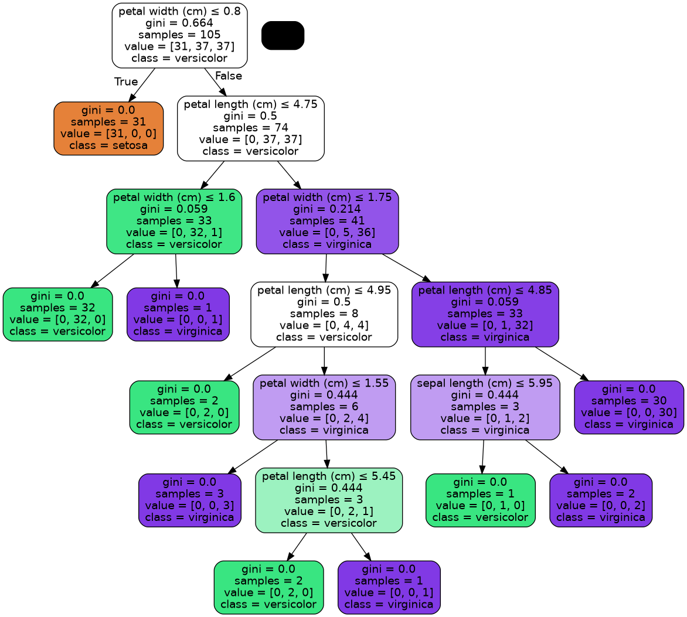

# Basic Machine Learning for Robotics - Introduction to ML

[](https://python.org)
[](https://scikit-learn.org/)

> **First step into Machine Learning for Robotics** - A beginner-friendly implementation of a Decision Tree classifier using the classic Iris dataset.

## 🎯 Overview

This project demonstrates the fundamentals of supervised machine learning for robotics applications. Using a **Decision Tree Classifier**, we classify iris flower species based on their morphological features - a simple but powerful analogy for how robots can learn to classify objects from sensor data.

**Key Concepts Covered:**
- ✅ Loading and exploring datasets (`sklearn.datasets`)
- ✅ Splitting data into training and testing sets
- ✅ Training a Decision Tree classifier
- ✅ Evaluating model accuracy
- ✅ Visualizing decision trees for interpretability

## 📊 Dataset

**Iris Dataset** - A classic in ML education:
- **150 samples** of iris flowers
- **3 species**: Setosa, Versicolor, Virginica
- **4 features**:
  - Sepal length (cm)
  - Sepal width (cm)
  - Petal length (cm)
  - Petal width (cm)


## ⚙️ Installation

Follow these steps to set up the project on your local machine:

```bash
# 1. Clone the repository
git clone https://github.com/MohamedAliZouariEng/Basic-Machine-Learning-for-Robotics.git

# 2. Navigate to the project root folder
cd Basic-Machine-Learning-for-Robotics

# 3. Create a virtual environment
python3 -m venv venv

# 4. Activate the virtual environment
# On Linux:
source venv/bin/activate

# 5. Install required packages from root requirements.txt
pip install -r requirements.txt

# 6. Navigate to the intro-to-ml project folder
cd 01-intro-to-ml

# 7. Run the script
python3 intro-to-ml.py
```


**What happens when you run it:**
1. 📥 Loads the Iris dataset
2. 🔀 Splits data (70% train, 30% test)
3. 🌳 Trains a Decision Tree classifier
4. 📊 Prints accuracy score to console
5. 🖼️ Displays an interactive matplotlib visualization
6. 💾 Saves the tree as `iris_decision_tree.png`

## 📈 Results

Typical output after running the script:

```
Accuracy: 0.98
```

> **Note:** Accuracy may vary slightly due to random splitting (random_state=42 ensures reproducibility).

## 🌳 Decision Tree Visualization

The decision tree provides **interpretable rules** - crucial for robotics where understanding *why* a robot made a decision is often as important as the decision itself.



**Example decision path:**
```
Petal width ≤ 0.8 cm → Setosa
Petal width > 0.8 cm → Further splits based on petal length/width
```

### Why Decision Trees for Robotics?
- 🔍 **Transparent**: Easy to debug and validate
- 🏃 **Fast inference**: Suitable for real-time applications
- 📐 **No feature scaling needed**: Works with raw sensor data
- 🧩 **Modular**: Can be combined into Random Forests for better accuracy

## 📚 References

- **Course Material**: [The Construct - Robotics & AI Learning Platform](https://www.theconstruct.ai/)
