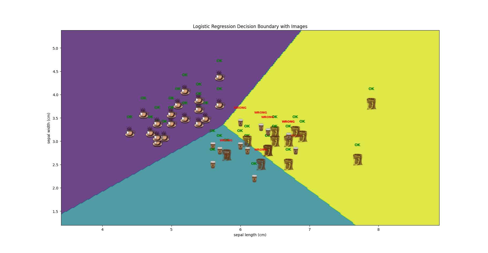

#  Basic Machine Learning for Robotics – Classification

[](https://www.python.org/)
[](https://scikit-learn.org/)

## 📌 Overview

This project demonstrates a **binary and multi-class classification** task using the famous **Iris dataset** and **Logistic Regression**. The focus is on visualizing decision boundaries with custom image markers to simulate a robotics perception scenario (e.g., object recognition).

The model is trained using only **two features** (sepal length and sepal width) to make the decision boundary visualizable in 2D, while still achieving **82% accuracy** on the test set.

## 🧠 Key Concepts Covered

- ✅ Loading and exploring the Iris dataset
- ✅ Train-test split for model validation
- ✅ Logistic Regression for multi-class classification
- ✅ Performance metrics: Accuracy, Precision, Recall, F1-Score
- ✅ Confusion Matrix analysis
- ✅ Custom decision boundary visualization with images

## 📊 Model Performance

| Metric      | Score  |
|-------------|--------|
| Accuracy    | 0.82   |
| Precision   | 0.81   |
| Recall      | 0.79   |
| F1-Score    | 0.79   |

### Confusion Matrix

```
[[19  0  0]
 [ 0  7  6]
 [ 0  2 11]]
```

## 🖼️ Visualization

The script generates a **decision boundary plot** with:
- Colored regions representing predicted classes
- Custom images (coffee icons) representing each data point
- "OK" (green) and "WRONG" (red) labels for correct/incorrect predictions




## 🚀 Getting Started

### Prerequisites

- Python 3.7 or higher
- Git

### Installation & Setup

1️⃣ **Clone the repository**

```bash
git clone https://github.com/MohamedAliZouariEng/Basic-Machine-Learning-for-Robotics.git
cd Basic-Machine-Learning-for-Robotics/
```

2️⃣ **Create and activate a virtual environment**

```bash
python3 -m venv venv
source venv/bin/activate      # On Linux
```

3️⃣ **Install dependencies**

```bash
pip install -r requirements.txt
```

4️⃣ **Run the classification script**

```bash
cd 02-classification
python3 classification.py
```


## 🎯 Usage Example

The script automatically:
- Loads the Iris dataset
- Reduces features to sepal length & sepal width
- Splits data (70% train, 30% test)
- Trains a Logistic Regression model
- Prints evaluation metrics
- Displays the decision boundary with custom icons

## 🤖 Robotics Relevance

In robotics, classification is used for:
- **Object recognition** (identifying coffee cups, tools, etc.)
- **Terrain classification** (floor types for navigation)
- **Gesture recognition** (human-robot interaction)
- **Anomaly detection** (fault prediction)

This example mimics how a robot could distinguish between different object classes (here: three types of coffee icons) based on sensory features.

## 📚 References

- [The Construct – Robotics AI & Machine Learning](https://www.theconstruct.ai/)
