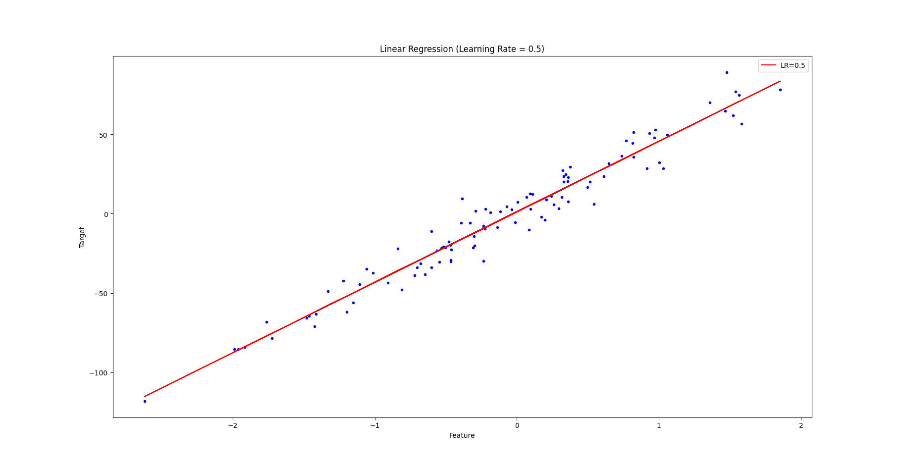

# Basic Machine Learning for Robotics - Training Models

## 📌 Overview

This project demonstrates **Linear Regression using Gradient Descent** from scratch, implemented as part of a robotics-focused machine learning series. The code generates synthetic regression data and optimizes a linear model using batch gradient descent to understand how learning rates affect convergence.

> 🔗 **Main Repository**: [MohamedAliZouariEng/Basic-Machine-Learning-for-Robotics](https://github.com/MohamedAliZouariEng/Basic-Machine-Learning-for-Robotics.git)

---

---

## 🚀 Features

- ✅ Synthetic regression dataset generation (`make_regression`)
- ✅ Custom gradient descent implementation
- ✅ Visualization of regression lines for different learning rates
- ✅ Cost history tracking (MSE) over iterations
- ✅ Comparison plot showing convergence behavior

---

## 📊 What You'll See

The script runs gradient descent with **5 different learning rates**:
- `0.001` (slow convergence)
- `0.01` 
- `0.1` 
- `0.5` 
- `1.0` (may overshoot)

For each learning rate, it displays:
1. A **scatter plot** of the data with the fitted regression line
2. A **cost history plot** comparing MSE across iterations

---

## 🛠️ Installation & Usage

### 1️⃣ Clone the Repository

```bash
git clone https://github.com/MohamedAliZouariEng/Basic-Machine-Learning-for-Robotics.git
cd Basic-Machine-Learning-for-Robotics/
```

### 2️⃣ Create & Activate Virtual Environment

```bash
python3 -m venv venv
source venv/bin/activate      # On Linux
```

### 3️⃣ Install Dependencies

```bash
pip install -r requirements.txt
```

### 4️⃣ Run the Script

```bash
cd 03-training-models
python3 training-models.py
```

---

## 🧠 Code Explanation

| Function | Purpose |
|----------|---------|
| `gradient_descent()` | Performs batch gradient descent to find optimal θ (slope & intercept) |
| `plot_regression_line()` | Visualizes the fitted line against raw data |
| `plot_cost_history()` | Compares MSE reduction across learning rates |

### 🔧 Gradient Descent Formula Used

```
θ = θ - learning_rate × (2/m) × X_bᵀ · (X_b · θ - y)
```

Where:
- `θ` = parameters (intercept, slope)
- `X_b` = design matrix (augmented with ones for bias term)
- `m` = number of samples

---

## 📈 Expected Output

- 5 regression line plots (one per learning rate)
- 1 combined cost history plot showing how quickly each learning rate minimizes MSE

> **Observation**: A learning rate too low (0.001) converges slowly, while too high (1.0) may cause divergence or oscillation.

---

## 📚 References

-  **The Construct** – Robotics AI & Machine Learning Courses  
  👉 [https://www.theconstruct.ai/](https://www.theconstruct.ai/)
