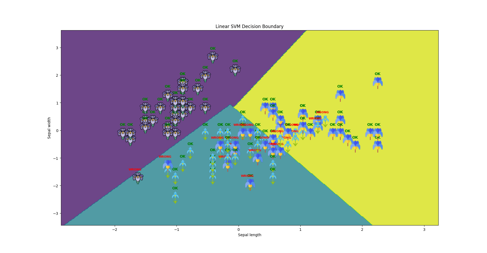

# Basic Machine Learning for Robotics -  SVM Classification

[](https://www.python.org/)
[](https://scikit-learn.org/)

A comprehensive implementation of **Support Vector Machine (SVM)** classifiers for the classic Iris dataset, featuring both linear and RBF kernels with interactive decision boundary visualization.


## 🎯 Overview

This project demonstrates the application of **Support Vector Machines (SVM)** for multi-class classification using the Iris dataset. It compares two kernel functions:
- **Linear Kernel**: Simple linear decision boundaries
- **RBF Kernel** (Radial Basis Function): Non-linear decision boundaries

The implementation includes data preprocessing, model training, evaluation, and interactive visualization of decision boundaries with flower images.

## ✨ Features

- ✅ Data standardization using `StandardScaler`
- ✅ Train-test split (70/30 ratio)
- ✅ Linear and RBF SVM classifiers comparison
- ✅ Comprehensive classification reports (precision, recall, f1-score)
- ✅ Interactive decision boundary visualization
- ✅ Image-based data point representation
- ✅ Correct/incorrect prediction labeling

## 📦 Prerequisites

- Python 3.7 or higher
- pip (Python package installer)

## 🚀 Installation

Clone the repository and set up the virtual environment:

```bash
# Clone the repository
git clone https://github.com/MohamedAliZouariEng/Basic-Machine-Learning-for-Robotics.git

# Navigate to the project directory
cd Basic-Machine-Learning-for-Robotics/

# Create a virtual environment
python3 -m venv venv

# Activate the virtual environment
# On macOS/Linux:
source venv/bin/activate

# Install required packages
pip install -r requirements.txt
```


## 💻 Usage

Run the SVM classification script:

```bash
cd 04-svm-classification
python3 svm-classification.py
```

The script will:
1. Load the Iris dataset (using only sepal length and width features)
2. Standardize the features
3. Split data into training and testing sets
4. Train both Linear and RBF SVM classifiers
5. Display classification reports
6. Generate decision boundary visualizations

## 📊 Results

### Linear SVM Performance
```
              precision    recall  f1-score   support
           0       1.00      1.00      1.00        19
           1       0.70      0.54      0.61        13
           2       0.62      0.77      0.69        13

    accuracy                           0.80        45
```

### RBF SVM Performance
```
              precision    recall  f1-score   support
           0       1.00      1.00      1.00        19
           1       0.54      0.54      0.54        13
           2       0.54      0.54      0.54        13

    accuracy                           0.73        45
```

**Key Insight**: Linear SVM outperforms RBF SVM on this dataset when using only two features, achieving 80% accuracy vs 73% for RBF.


## Visualization

The script generates two interactive plots:

1. **Linear SVM Decision Boundary**: Shows linear separation between classes
2. **RBF SVM Decision Boundary**: Shows non-linear decision boundaries

Each plot features:
- Colored decision regions
- Flower images at data points
- "OK" (green) or "WRONG" (red) labels for predictions

## 📚 References

- **Course Material**: [The Construct - Robotics & AI Learning Platform](https://www.theconstruct.ai/)
