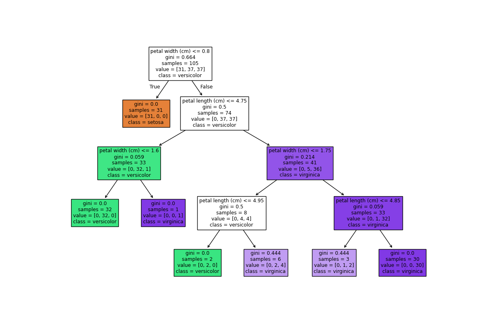

# Basic Machine Learning for Robotics - Decision Trees 

[](https://www.python.org/)
[](https://scikit-learn.org/)

## 📋 Overview

This project demonstrates **Decision Tree Classifiers** applied to the famous **Iris Dataset**. It visualizes how different tree depths (`max_depth=2`, `4`, and `5`) affect the decision boundaries and model complexity. Perfect for understanding the trade-off between underfitting and overfitting in tree-based models.

## 🎯 Key Features

- ✅ Loads and preprocesses the Iris dataset
- ✅ Trains Decision Tree classifiers with varying depths
- ✅ Visualizes tree structures with colorful, interpretable diagrams
- ✅ Saves tree visualizations as PNG files
- ✅ Demonstrates impact of tree depth on model complexity


## 🚀 Getting Started

### Prerequisites

- Python 3.7 or higher
- Git

### Installation & Setup

1. **Clone the repository**
```bash
git clone https://github.com/MohamedAliZouariEng/Basic-Machine-Learning-for-Robotics.git
cd Basic-Machine-Learning-for-Robotics/
```

2. **Create and activate virtual environment**
```bash
python3 -m venv venv
source venv/bin/activate  
```

3. **Install dependencies**
```bash
pip install -r requirements.txt
```

4. **Run the script**
```bash
ccd 05-decision-trees
python3 decision-trees.py
```

## 📊 Output

The script generates three visualization files:

| File | Description |
|------|-------------|
| `decision_tree_max_depth_2.png` | Simple tree (2 levels) - may underfit |
| `decision_tree_max_depth_4.png` | Moderate complexity tree |
| `decision_tree_max_depth_5.png` | Deeper tree - may capture more patterns |

## 🧠 Understanding Decision Trees

Decision Trees are **supervised learning algorithms** that:
- Split data recursively based on feature values
- Create interpretable, rule-based decision paths
- Handle both classification and regression tasks

### Depth Impact:
- **Shallow trees (depth=2)**: Simpler, faster, may underfit
- **Deeper trees (depth=5)**: More complex, risk of overfitting
- **Optimal depth**: Found through cross-validation

## 🔗 References

- [The Construct - Robotics & AI Learning Platform](https://www.theconstruct.ai/)
