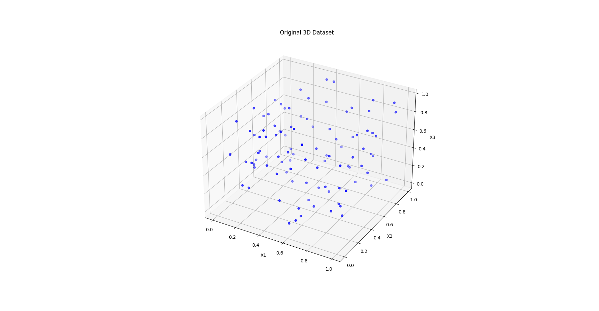

# Basic Machine Learning for Robotics -  Dimensionality Reduction with PCA – 3D to 2D Projection

This project demonstrates **Principal Component Analysis (PCA)** for dimensionality reduction, transforming a random 3D dataset into a 2D space while preserving the most significant variance.  
It’s part of the **Basic Machine Learning for Robotics** series.


📌 **GitHub Repository:**  
[Basic-Machine-Learning-for-Robotics](https://github.com/MohamedAliZouariEng/Basic-Machine-Learning-for-Robotics.git)  
📍 **Folder:** `06-dimensionality-reduction`

---

## What This Code Does

1. Generates a **random 3D dataset** (100 points, 3 features).
2. Visualizes the data in **3D space** using `matplotlib`.
3. Applies **PCA** to reduce dimensions from 3 → 2.
4. Plots the **projected 2D data** on the first two principal components.

---

## 📦 Requirements

All dependencies are listed in `requirements.txt`.  
Create and activate a virtual environment before installing them.

```bash
# Clone the repository first
git clone https://github.com/MohamedAliZouariEng/Basic-Machine-Learning-for-Robotics.git
cd Basic-Machine-Learning-for-Robotics/

# Set up virtual environment
python3 -m venv venv
source venv/bin/activate  

# Install required packages
pip install -r requirements.txt
```
---

## ▶️ How to Run

```bash
cd 06-dimensionality-reduction
python3 dimensionality-reduction.py
```

You will see two plots:

1. 🧊 **Original 3D Dataset** – points randomly distributed in 3D space.
2. 📉 **2D Projection** – same data after PCA transformation.

---


## 🧠 Why This Matters for Robotics

- **Dimensionality reduction** helps robots handle high-dimensional sensor data (LiDAR, cameras, IMUs) efficiently.
- **PCA** is often used for:
  - Feature compression before classification
  - Noise reduction
  - Visualization of high-dimensional robot states
  - Faster real-time processing

---

## 📚 Reference

This project is based on the **The Construct** ROS & Robotics Learning Platform:  
🔗 [https://www.theconstruct.ai/](https://www.theconstruct.ai/)

---
