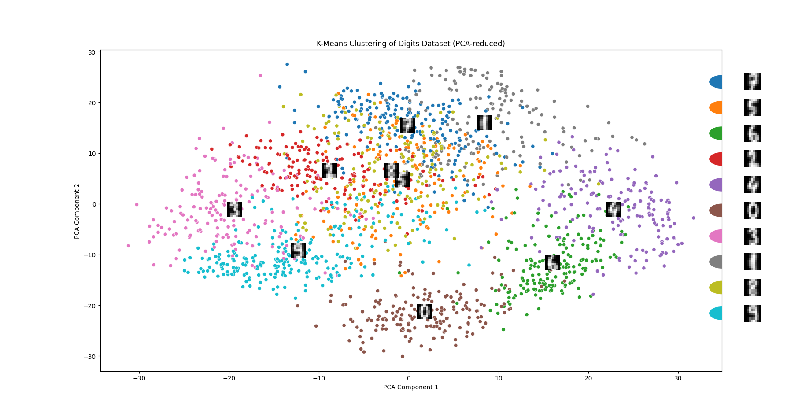

#  Basic Machine Learning for Robotics - K-Means Clustering on Digits Dataset


## 📋 Overview

This project demonstrates **unsupervised machine learning** using the **K-Means clustering algorithm** on the classic **Digits dataset** (handwritten digits 0-9). The implementation includes:

- 🎯 **Dimensionality reduction** using PCA (Principal Component Analysis)
- 🔍 **Clustering** with K-Means (10 clusters representing digits 0-9)
- 🖼️ **Visualization** of cluster centroids as actual digit images
- 📊 **2D projection** of the high-dimensional data


##  Getting Started

### Prerequisites

- Python 3.7 or higher
- Git

### Installation & Setup

1. **Clone the repository**
   ```bash
   git clone https://github.com/MohamedAliZouariEng/Basic-Machine-Learning-for-Robotics.git
   cd Basic-Machine-Learning-for-Robotics/
   ```

2. **Create a virtual environment**
   ```bash
   python3 -m venv venv
   ```

3. **Activate the virtual environment**
   
   - **On Linux/macOS:**
     ```bash
     source venv/bin/activate
     ```

4. **Install dependencies**
   ```bash
   pip install -r requirements.txt
   ```

5. **Run the script**
   ```bash
   cd 07-clustering
   python3 clustering.py
   ```


## How It Works

1. **Load Data**: The Digits dataset (8x8 images of handwritten digits) is loaded from `sklearn.datasets`

2. **Dimensionality Reduction**: PCA reduces the 64-dimensional data to 2 principal components for visualization

3. **Clustering**: K-Means groups the data into 10 clusters (matching the 10 digits)

4. **Visualization**:
   - Scatter plot of data points colored by cluster assignment
   - Cluster centroids displayed as digit images at their PCA-projected positions
   - Custom legend showing each cluster's representative digit

## 📊 Output

The script generates a visualization with:
- ✅ 1,797 data points (digit images) plotted in 2D PCA space
- ✅ 10 cluster centroids shown as actual 8x8 digit images
- ✅ Color-coded clusters (10 distinct colors)
- ✅ Legend mapping colors to digit images

## 📖 Code Explanation

| Component | Description |
|-----------|-------------|
| `load_digits()` | Loads the handwritten digits dataset |
| `PCA(n_components=2)` | Reduces dimensions for 2D plotting |
| `KMeans(n_clusters=10)` | Clusters data into 10 groups |
| `cluster_centers_` | Extracts centroid coordinates in original space |
| `OffsetImage` | Embeds digit images into matplotlib plots |
| `AnnotationBbox` | Positions images at specific coordinates |


## 📚 Learning Resources
- **The Construct** - For robotics and AI learning resources  
  🔗 [https://www.theconstruct.ai/](https://www.theconstruct.ai/)
