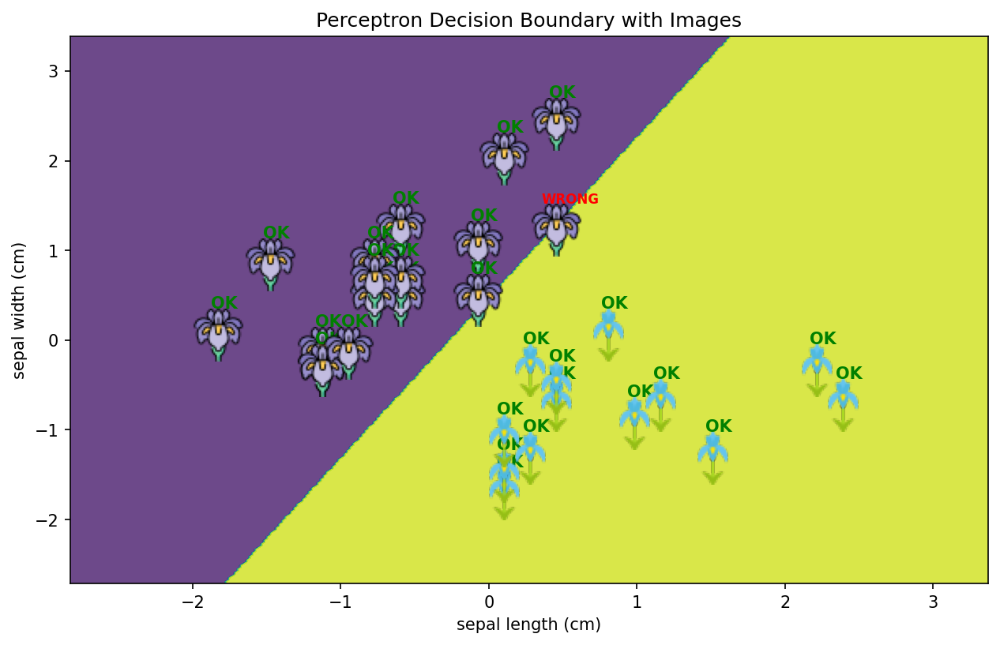

# Basic Machine Learning for Robotics - Perceptron Classifier 
[](https://www.python.org/)
[](https://scikit-learn.org/)

> 🧠 **Basic Machine Learning for Robotics** - Implementing a Perceptron classifier with 2D visualization and image annotations.

This project demonstrates a **Perceptron** model applied to the **Iris dataset** (binary classification: Setosa vs Versicolor), featuring:
- ✅ Data preprocessing & standardization
- 📊 Performance metrics (accuracy, precision, recall, F1-score)
- 🖼️ Decision boundary visualization with image icons

---

## 🚀 Getting Started

### Prerequisites
- Python 3.8 or higher
- Git

### Installation & Setup

1️⃣ **Clone the repository**
```bash
git clone https://github.com/MohamedAliZouariEng/Basic-Machine-Learning-for-Robotics.git
cd Basic-Machine-Learning-for-Robotics/
```

2️⃣ **Create a virtual environment**
```bash
python3 -m venv venv
```

3️⃣ **Activate the virtual environment**

- **Linux:**
  ```bash
  source venv/bin/activate
  ```

4️⃣ **Install dependencies**
```bash
pip install -r requirements.txt
```

5️⃣ **Run the perceptron classifier**
```bash
cd 08-perceptron
python3 perceptron.py
```

---


## 🧠 How It Works

### 1. Data Preparation
- Loads Iris dataset (sepal length & width only)
- Filters to **binary classification** (Setosa = 0, Versicolor = 1)
- Splits data (70% train, 30% test)
- Standardizes features using `StandardScaler`

### 2. Model Training
- Uses `sklearn.linear_model.Perceptron`
- Hyperparameters: `max_iter=1000`, `tol=1e-3`
- Learns a linear decision boundary

### 3. Evaluation Metrics
| Metric       | Value |
|--------------|-------|
| Accuracy     | 0.97  |
| Precision    | 0.93  |
| Recall       | 1.00  |
| F1-Score     | 0.96  |

**Confusion Matrix:**
```
[[16  1]
 [ 0 13]]
```

### 4. Visualization
The script generates a **decision boundary plot** where:
- ✅ **Green "OK"** tags = correct predictions
- ❌ **Red "WRONG"** tags = misclassifications

---


## 📚 References

- **Main Learning Resource:** [The Construct](https://www.theconstruct.ai/) - Robotics & ROS simulation platform
---
