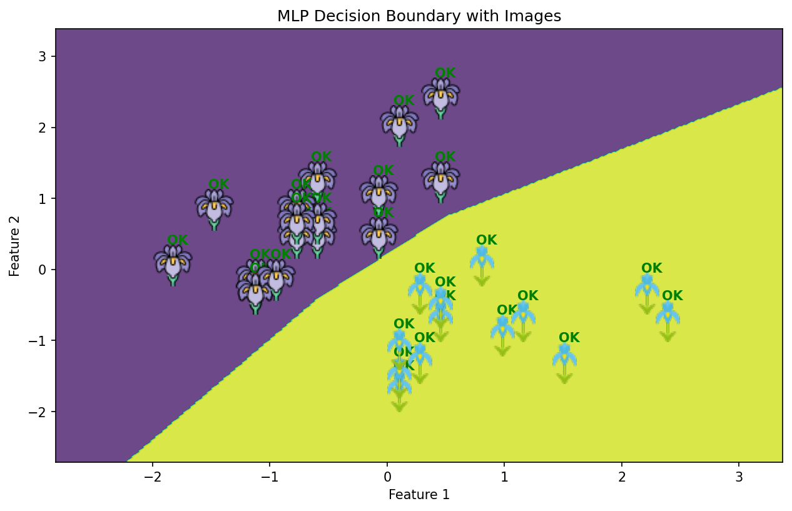

# Basic Machine Learning for Robotics - Multi-Layer Perceptron Classifier 

[](https://www.python.org/)
[](https://scikit-learn.org/)

## 📋 Overview

This project implements a **Multi-Layer Perceptron (MLP)** classifier using the Iris dataset to demonstrate binary classification with neural networks. The model visualizes decision boundaries with custom image markers, making it ideal for robotics perception tasks.

## 🎯 Features

- ✅ Binary classification of Iris flower types (Setosa vs Versicolor)
- 🔍 Decision boundary visualization with custom image markers
- 📊 Comprehensive performance metrics (Accuracy, Precision, Recall, F1-Score)
- 🎨 Visual feedback showing correct/incorrect predictions
- 🧹 Data preprocessing with StandardScaler

## 📁 Repository Structure

```
Basic-Machine-Learning-for-Robotics/
└── 09-multilayer-perceptron/
    ├── multilayer-perceptron.py
    ├── requirements.txt
    ├── README.md
    └── images/
        ├── coffee1.png  # Class 0 marker
        └── coffee2.png  # Class 1 marker
```

## 🚀 Getting Started

### Prerequisites

- Python 3.7 or higher
- Git

### Installation & Setup

1. **Clone the repository**
```bash
git clone https://github.com/MohamedAliZouariEng/Basic-Machine-Learning-for-Robotics.git
cd Basic-Machine-Learning-for-Robotics/
```

2. **Create and activate virtual environment**
```bash
# On Linux
python3 -m venv venv
source venv/bin/activate

```

3. **Install dependencies**
```bash
pip install -r requirements.txt
```

4. **Prepare images**  
Place your marker images in the `images/` folder:
- `coffee1.png` - Marker for class 0
- `coffee2.png` - Marker for class 1

5. **Run the script**
```bash
cd 09-multilayer-perceptron
python3 multilayer-perceptron.py
```

## 📊 Results

The model achieves perfect classification on the test set:

```
Accuracy: 1.00
Precision: 1.00
Recall: 1.00
F1 Score: 1.00
Confusion Matrix:
[[17  0]
 [ 0 13]]
```

## 📈 Model Architecture

- **Input Layer**: 2 features (sepal length & width)
- **Hidden Layer**: 10 neurons
- **Output Layer**: 2 classes (binary classification)
- **Activation Function**: ReLU (default)
- **Optimizer**: Adam
- **Max Iterations**: 1000

## 🖼️ Visualization Output

The script generates a decision boundary plot with:
- 🟢 **Green "OK" labels** for correct predictions
- 🔴 **Red "WRONG" labels** for incorrect predictions
- 🖼️ **Custom image markers** for each data point
- 🎨 **Colored regions** showing decision boundaries


## 📚 References

- [The Construct - Robotics & AI Learning Platform](https://www.theconstruct.ai/)
