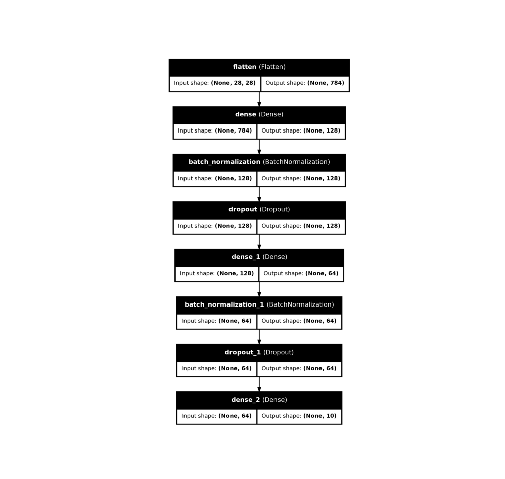

# Basic Machine Learning for Robotics - Neural Networks

[](https://www.python.org/)
[](https://www.tensorflow.org/)

## 📌 Overview

This project implements a **Neural Network** for handwritten digit recognition using the **MNIST dataset**. It demonstrates fundamental deep learning concepts essential for robotics applications, including computer vision and pattern recognition.

## 🎯 Key Features

- ✅ **MNIST Dataset** - 70,000 handwritten digits (0-9)
- ✅ **Multi-Layer Perceptron (MLP)** architecture
- ✅ **Batch Normalization** for stable training
- ✅ **Dropout Regularization** (30%) to prevent overfitting
- ✅ **Early Stopping** with ModelCheckpoint
- ✅ **Interactive Visualization** of predictions
- ✅ **Model Architecture Diagram** generation

## 🏗️ Model Architecture

```
Input Layer (28x28) → Flatten (784)
       ↓
Dense Layer 1 (128 neurons, ReLU)
       ↓
Batch Normalization
       ↓
Dropout (30%)
       ↓
Dense Layer 2 (64 neurons, ReLU)
       ↓
Batch Normalization
       ↓
Dropout (30%)
       ↓
Output Layer (10 neurons, Softmax)
```

## 📊 Performance

- **Test Accuracy**: ~97-98% (depending on training)
- **Loss Function**: Sparse Categorical Crossentropy
- **Optimizer**: Adam
- **Epochs**: 20 (with early stopping)

## 🛠️ Installation & Setup

### 1️⃣ Clone the Repository

```bash
sudo apt-get update
sudo apt-get install python3-tk
sudo apt-get install graphviz
git clone https://github.com/MohamedAliZouariEng/Basic-Machine-Learning-for-Robotics.git
cd Basic-Machine-Learning-for-Robotics/
```

### 2️⃣ Create Virtual Environment

```bash
python3 -m venv venv
```

### 3️⃣ Activate Virtual Environment

**On Linux:**
```bash
source venv/bin/activate
```


### 4️⃣ Install Dependencies

```bash
pip install -r requirements.txt
```

### 5️⃣ Run the Neural Network

```bash
cd 10-neural-networks
python3 neural-networks.py
```


> **Note**: You may need to install Graphviz system-wide:
> - **Ubuntu/Debian**: `sudo apt-get install graphviz`

## 🚀 Usage

### Training the Model

The script automatically:
1. Loads and normalizes MNIST data
2. Builds the neural network architecture
3. Trains for up to 20 epochs with validation split (20%)
4. Saves the best model (`best_model.keras`) and final model (`final_model.keras`)
5. Generates architecture diagram (`model_architecture.png`)

### Making Predictions

The `visualize_prediction()` function:
- Randomly selects a test image
- Displays the image with actual vs predicted label
- Helps visualize model performance

```python
# Random prediction
visualize_prediction()

# Predict specific index
visualize_prediction(index=42)
```

## 🎨 Visual Outputs

### Model Architecture Diagram
The script generates a visual representation of the neural network architecture using `plot_model()`.

### Prediction Visualization
Random test images are displayed with:
- 🔵 **Actual label** (ground truth)
- 🟢 **Predicted label** (model output)

## 🤖 Robotics Applications

This neural network demonstrates concepts crucial for robotics:
- **Computer Vision**: Recognizing digits from camera input
- **Pattern Recognition**: Learning from labeled examples
- **Real-time Inference**: Fast predictions for robot decision-making
- **Model Deployment**: Saving/loading models for robotic systems


## 📚 References

- **[The Construct](https://www.theconstruct.ai/)** - Robotics simulation and learning platform
